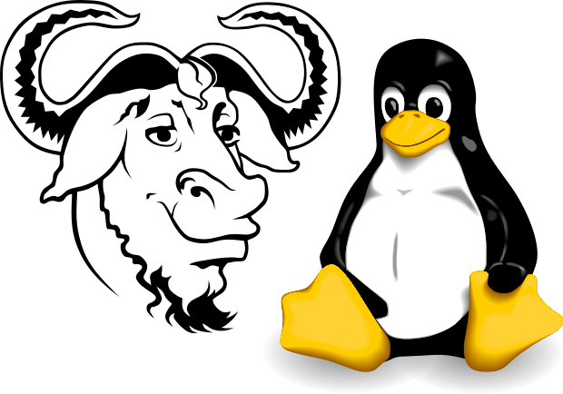

========
Linux
========

`Контест: Linuxcourse <https://school9.perm.ru/gate/tester/?page=testing&changeto=389>`_

О системе
==========

Введение
---------------------

**Linux** - ядро ОС, разработка начата финским студентом Линусом Торвальдсом.

    * Ядро - наиболее низкий уровень абстракции для доступа приложений к ресурсам системы, необходимым для их работы.
 
**GNU/Linux** - операционные системы, основанные на ядре Linux и системных библиотеках GNU (а часто и другом ПО)

Системы **GNU/Linux** распространяются на условиях лицензии особого рода, известной под названием **GNU-лицензии** *(GNU General Public License, или GPL)*. Она устанавливает несколько условий на распространение и изменение свободного программного обеспечения. **GNU-лицензия** делает программное обеспечение свободно распространяемым, но не передаёт его в пользование обществу, а защищает права автора. 

Согласно **GNU** программа свободна, если у ее пользователей есть четыре важнейших свободы:

* Свобода выполнять программу как вам угодно в любых целях *(свобода 0)*.
* Свобода изучать работу программы и модифицировать программу, чтобы она выполняла ваши вычисления, как вы пожелаете *(свобода 1)*. Это предполагает доступ к исходному тексту.
* Свобода передавать копии, чтобы помочь другим *(свобода 2)*.
* Свобода передавать копии своих измененных версий другим *(свобода 3)*. Этим вы можете дать всему сообществу возможность получать выгоду от ваших изменений. Это предполагает доступ к исходному тексту.

Ядро
--------

Ядро **Linux** - очень большая программа, представляющая следующие функции:

**Хранение данных:**

* RAM - Чтение и запись данных в оперативную память.
* Постоянное хранение - Чтение и запись данных на постоянные запоминающие устройства.
* Виртуальная файловая система.

**Доступ к сетям:**

* Работа с физическими сетями (Ethernet, Wireless, LTE, коммутаторы, Bluetooth.
* Виртуальные сети.

**Планирование задач:**

* Совместное использование процессорного времени программами.
* Балансировка нагрузки процессора и приоритеты.

**Поддержка внешних устройств:**

* Съемные USB носители.
* Веб-камеры.
* Мыши и клавиатуры.

**Безопасность:**

* Права доступа к файлам для пользователей и групп;
* Разрешение доступа к ресурсам системы;

Спор об именовании
-------------------------------------

.. container:: vl

    *Если вы называете нашу операционную систему “Linux”, это передаёт неверное представление о её истоках, истории и назначении. Если вы называете её “GNU/Linux”, это передаёт (хоть и не во всех подробностях) правильное представление.*
    
\- Gnu.org

Операционные системы, основанные на ядре **Linux** и системных библиотеках **GNU** , часто называют просто **Linux**. Однако проект **GNU** настаивает на названии **GNU/Linux**. Особо сильно на это реагриуерт *Ричард Мэттью Столлман(RMS)*, основатель движения свободного ПО и проекта **GNU**.

*Линус Торвальдс*, автор ядра **Linux**, на настойчивые требования *Ричарда Столлмана* поддержать его позицию всегда реагировал слабо, заявляя, что занимается разработкой программного обеспечения, а не политикой.

*RMS*:

Дистрибутивы
==============

Дистрибутив **GNU/Linux** — общее определение операционных систем, использующих ядро Linux, представляющий собой настроенную систему с предустановленным комплектом приложений. У каждого дистрибутива свои правила и свое сообщество.

В настоящее время существует более шестисот дистрибутивов **GNU/Linux**; более половины из них поддерживаются в актуальном состоянии, что обеспечивается регулярным выпуском обновлений разработчиками дистрибутива.

Современные диструбутивы берут начало от трех старейших: **Slackware**, **Debian**, **Red Hat**.

`GNU/Linux Distributions Timeline <https://upload.wikimedia.org/wikipedia/commons/1/1b/Linux_Distribution_Timeline.svg>`_ 

Применение
============

Благодаря возможностями трансформации и масштабирования **Linux** ее можно встретить во всех областях компьютерной техники.

* Лидер на рынке серверов.
* Лидер на рынке мобильных ОС (*Ядро ОС Android - Linux*).
* Лидер на рынке встраеваемых систем.
* Главный элемент кластеров и моделей распределенных вычислений.
* 100% суперкомпьютеров из ТОП-500 мира работают на **Linux**.
* Востребован наукоемкими специальностями благодаря высокой скорости вычислений.

Работа c cистемой
===================

Графический интерфейс
---------------------------------------------

Внешний вид cистемы очень близок к популярным **Windows** или **Mac OS**, поэтому новым пользователям не придется долго привыкать к системе. С другой стороны, под **Linux** существует множество графических оболочек на любой вкус, цвет и характеристики компьютера. Любую из них можно настроить до мелочей.

Примеры:

* `Reddit <https://www.reddit.com/r/unixporn/hot/>`_
* `Сообщество VK <https://vk.com/unixporn>`_

Консоль
----------------

Куда более интересная часть системы. Взаимодействуя с компьютером через *консоль* можно сделать все то же, что и через графический интерфейс, и даже много больше.

*Терминал* - это устройство, при помощи которого человек взаимодействуют с компьютером. Изначально в качестве терминалов применялись электромеханические телетайпы.

В большинстве современных компьютеров работа терминала эмулируется средствами ОС, позволяя работать с текстовыми приложениями, когда графическую оболочку запустить невозможно или не нужно. При запущенной же графической оболочке возможно использовать специальные приложения — *эмуляторы терминала*. Современный терминал и эмуляторы сейчас обобщенно называют *консолями*.

Взаимодейсвтие с компьютером осуществляется посредством команд, которые имеют следующий вид:: 

 [название команды] <опции> [аргументы]

.. image:: https://github.com/Vladius25/linuxcourse/blob/master/cowsay.png?raw=true

.. csv-table:: 
   :widths: 10, 10

   "Название", "cowsay"
   "Опции", "-e99"
   "Аргумент", "Hellow, world"

Некоторые команды требуют прав *суперпользователя*.
*На самом деле, большинство команд - это программы, все так же с открытым исходным кодом, который можно редактировать*.

Файловая система. Права
----------------------------------------------

Отдельно стоит упамянуть о файловой системе(ФС) и правах доступа. В отличие от **Windows** в **GNU/Linux** используется ФС **ext4**. Одним из основных ее отличий является поддержка **прав доступа** к файлам и папкам

Права бывают трех типов:

* Read(**r**) - чтение файлов или папок.
* Write(**w**) - запись в файл или папку.
* Execute(**x**) - запуск программ.

Правами могут обладать:

* Владелец файла или папки.
* Группа пользователей.
* Все остальные, не входящие в первые 2 группы.

Так выглядит полная информация о правах на файл в ФС **ext4**::

 -rwx rw- r-- vladius wheel devyatka.cpp

Это значит, что права на файл *devyatka.cpp* распределены следующим образом:

.. csv-table::
   :header: "Роль", "Объект", "Права", "Обозначение"
   :widths: 20, 20, 20, 20

   "Владелец","*vladius*","read/write/execute","rwx"
   "Группа","*wheel*","read/write","rw-"
   "Остальные","*Все*","read","r--"

Особый пользователь **root** называется *суперпользователем* и имеет безграничные права на любой файл.

Cтандарт иерархии файловой системы(FHS)
----------------------------------------------------------------------------

**FHS** предлагает следующую иерархию подкатологов в корневом /:

* /bin - основные утилиты, необходимые как в однопользовательском режиме, так и при обычной работе всем пользователям.
* /boot - неизменяемые файлы, необходимые для загрузки системы.
* /dev - файлы устройств.
* /etc - файлы конфигурации системы на данном компьютере.
* /home - домашние каталоги пользователей.
* /lib - основные разделяемые библиотеки и модули ядра.
* /mnt - точку монтирования для временно подключаемых файловых систем.
* /root - домашний каталог пользователя root.
* /opt - дополнительное программное обеспечение..
* /sbin - основные системные программы для администрирования и настройки системы.
* /tmp - временные файлы.
* /usr - вторичная иерархия для данных пользователя. Содержит большинство пользовательских приложений и утилит, используемых в многопользовательском режиме.

    * /usr/bin - дополнительные программы для всех пользователей, не являющиеся необходимыми в однопользовательском режиме. 
    * **Факт**: Изначально  /usr использовался для хранения домашних директорий. Когда стало нехватать места под bin, было решено создать пользователя bin.
* /var - изменяемые файлы, такие как файлы регистрации, временные почтовые файлы.

Systemd
--------------

**Systemd** — подсистема инициализации **Linux** — *демон* (программа, работающая в фоне) для запуска других *демонов* в **Linux** и управления ими в процессе работы системы. Название происходит от принятого в **Unix** добавления суффикса *-d* к демонам.

Разработана *Леннартом Поттерингом* взамен используемого ранее демона *init*. В свое время вызвала огромное количество не утихающий до сих пор споров. Сейчас исользуется по умолчанию во всех популярных диструбутивах.

Помимо простого запуска и контроля сервисов, **systemd** предлагает некоторые другие удобные функции, для использования которых ранее системным администраторам приходилось прибегать к помощи дополнительных программ-демонов. Среди таких функций:

* Сокет-активация служб (заменяет *inetd*).
* Запуск сервисов по расписанию (заменяет *cron*).
* Работа с аппаратным сторожевым таймером (заменяет *watchdog*).
* Смена корня (заменяет *chroot*).
* Автомонтирование томов и сетевых ресурсов (заменяет *mount* и *fstab*).
* Удобная работа с логами посредством **journald** (заменяет *syslog*)

Установка приложений
-----------------------------------------

В отличие от **Windows** и **Mac OS** на **GNU/Linux** строго не рекоммендуется скачивать приложения с сайтов, даже с официальных. Все приложения представлены в виде *пакетов*, которые хранятся в *репозиториях* вашего дистрибутива.

Чтобы установить пакет, нужно воспользоваться графической утилитой или **пакетным менеджером** (В каждом диструбитве свой, например, *dnf* в **Fedora** или *apt* в **Debian/Ubuntu**). Пример использования ищите ниже.

Список часто используемых команд с пояснением
=============================================

Если хотите быстро понять, что делает команда, что означают ее опции и аргументы, зайдите на `explainshell.com <https://www.explainshell.com/>`_. К сожалению, ресурс заблокирован в России.

man
--------

* ``man <команда>`` - подробная информация о команде *<команда>*

pwd
-------

* ``pwd`` - текущая директория

cd
-------

* ``cd <директория>`` - сменить текущую директорию на <директория>

    * Директориями в **GNU/Linux** называются папки
    * ``~`` - домашняя директория пользователя

ls
---------

* ``ls`` - список файлов и папок в текущей директории
    
    * ``ls -l`` - подробный список(включает права, владельца, группу, размер и время редактирования)
    * ``ls -a`` - скрытые файлы и папки(которые начинаются с ``.``)
    * ``ls -la`` - две опции вместе
    * ``ls <дир>`` - список файлов в директории *<дир>*

touch
----------

* ``touch <файл>`` - создает файл *<файл>*

mkdir
----------

* ``mkdir <дир>`` - создает директорию *<дир>*
    
    * ``mkdir -p <дир>`` - создает директорию *<дир>* и все вышележащиее директории
    * например, ``mkdir -p /test/test2/test3`` - Создаст директории *test*, *test2*, *test3*

cp
-----

* ``cp <файл1> <файл2>`` - копировать *<файл1>* в *<файл2>*
    
    * ``cp -r <дир1> <дир2>`` - копировать директорию *<дир1>* в *<дир2>*

mv
-------

* ``mv <1> <2>`` - переместить файл или директорию <1> в <2>

rm
------

* ``rm <файл>`` - удаляет файл *<файл>*
    
    * ``rm -rf <дир>`` - удаляет директорию *<дир>* и все ее содержимое

echo
--------

* ``echo <текст>`` - печатает *<текст>*
    
    * ``echo <текст> > <файл>`` - заменяет содержимое файла *<файл>* текстом *<текст>*
    * ``echo <текст> >> <файл>`` - добавляет текст *<текст>* в конец файла *<файл>*
    * ``echo <текст> 1>&2`` - перенаправление **stdout** в **stderr**
    * Если целевого файла нет, он будет создан

cat
-----

* ``cat <файл>`` - печатает содержимое файла *<файл>*
    
    * ``cat <файл1> > <файл2>`` - заменяет содержимое файла *<файл1>* содержимым *<файл2>*
    * ``cat <файл1> >> <файл2>`` - добавляет текст файла *<файл1>* в конец файла *<файл2>*
    * Если целевого файла нет, он будет создан

ping
--------

* ``ping <хост>`` - проверить доступность <хост> в сети
    
    * Например, ``ping school9.perm.ru``
    * Чтобы остановить нажмите **Ctrl-C**

ip
-----

* ``ip`` - позволяет выполнять настройку сетевой подсистемы
    
    * ``ip link`` - информация о сетевых интерйесах
    * ``ip addr`` - информация о сетевых интерйесах и адресах
    * ``ip route`` - таблица маршрутиризации
    * ``ip neigh`` - текущая ARP-таблица(таблица соотвествия *IP-* и *MAC*-адресов)

useradd
--------

* ``useradd <пользователь>`` - создать пользователя *<пользователь>*
    
    * ``useradd -m <пользователь>`` - создать пользователя и его домашнюю директорию(*/home/<пользователь>*)

passwd
--------

* ``passwd <пользователь>`` - задать пароль пользователю *<пользователь>*

su
------

* ``su <пользователь>`` - авторизоваться под пользователем *<пользователь>*

sudo
--------

* ``sudo <команда>`` - выполнить команду *<команда>* от имени суперпользователя **root**
    
    * Требует права на использование. 
    * Не требует пароль **root**.
    * Все команды логируются.

exit
-------

* ``exit`` - выйти/деавторизоваться

ps
------

* ``ps`` - вывести список активных процессов текущего пользователя
    
    * ``ps -e`` - список всех активных процессов 

htop
--------

* ``top`` - вывести в виде таблицы перечень запущенных процессов и оценить, какой объем ресурсов они потребляют
* ``htop`` - аналогично. Более человеко-читаемый и удобный. Обычно используется вместо ``top``
    
    * Требуется пакет *htop* 

kill
------

* ``kill <pid>`` - отправляет сигнал процессу с идентификатором *<pid>*
    
    * ``kill -s <сигнал> <pid>`` - отправляет процессу с идентификатором *<pid>* сигнал *<сигнал>*
    * Если не указана опция ``-s`` отправит **SIGTERM**
    * ``man signal.7`` - подробнее о сигналах

ssh
------

* ``ssh <пользователь>@<хост>`` - удаленно подключиться к компьютеру *<хост>* и зайти под пользователем *<пользователь>*
    
    * **SSH** -  сетевой протокол, позволяющий производить удалённое управление операционной системой
    * Когда вы подключитесь к *<хост>*, увидите ту же консоль
    * ``ssh <пользователь>@<хост> -p <порт>`` - подключение к порту <порт>(если не указано, то используется 22)

scp
-------

* ``scp <файл> <пользователь>@<хост>:<дир>`` - отправить файл *<файл>* по протоколу **SSH** на компьютер *<хост>* под пользователем *<пользователь>* в директорию *<дир>*
   
    * Например, ``scp task.xml root@cab13c1.linux.sch9.lan:/home/vasyan/``
    * ``scp -r <дир1> <пользователь>@<хост>:<дир2>`` - то же самое для директории

hostname
-----------------

* ``hostname`` - имя компьютера

Установка пакетов
--------------------------------

* ``dnf install <пакет>`` - установка пакета *<пакет>* пакетным менеджером *dnf*
* ``apt install <пакет>``- установка пакета *<пакет>* пакетным менеджером *apt*
* ``pacman -S`` - установка пакета *<пакет>* пакетным менеджером *pacman*

Полезные комбинации клавиш
------------------------------

Не команды, но полезно знать

* ``Ctrl-C`` - посылает запущенному в треминале процессу **SIGINT** *(сигнал для остановки процесса)*
* ``Ctrl-D`` - комбинация, которая отправляет в консоль *EOF (End Of File)*. Работает схожим образом с ``exit``
* ``Ctrl-Z`` - отправляет процессу **SIGSTOP** *(сигнал, посылаемый для принудительной приостановки выполнения процесса)*

    * Для возобновления выполнения используется **SIGCONT** или команда ``fg``
